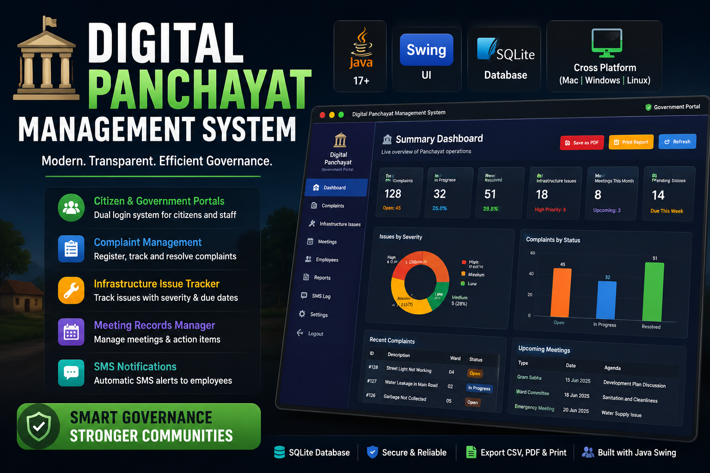
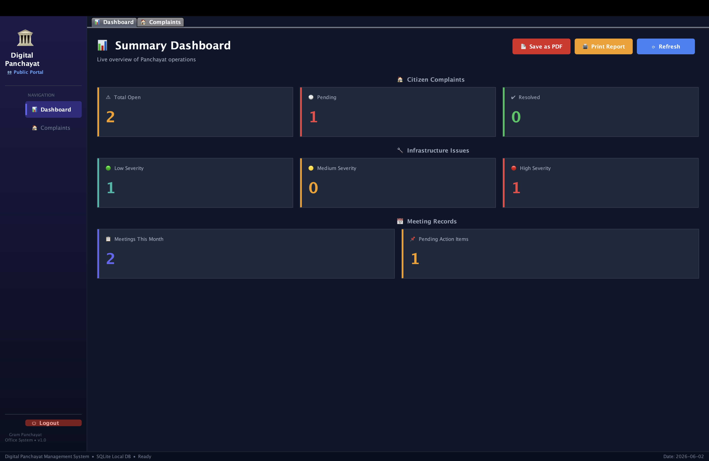
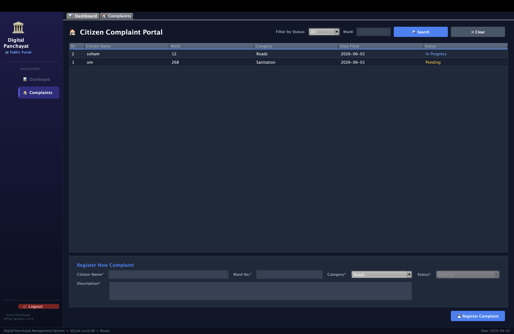
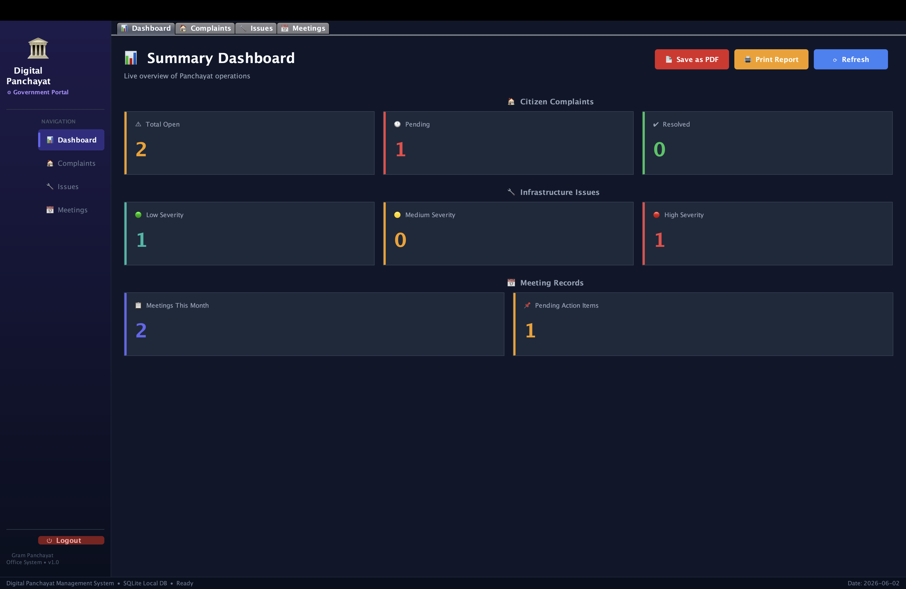
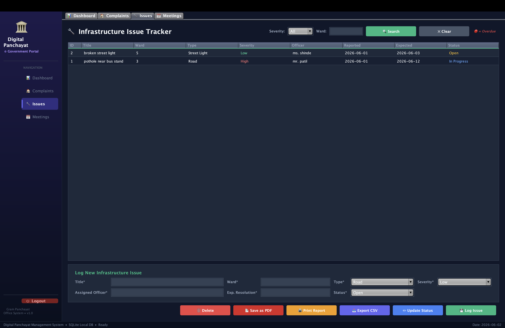
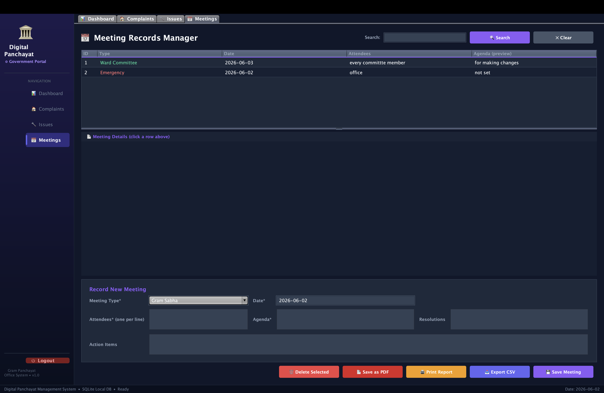

# 🏛 Digital Panchayat Management System

<p align="center">
  
</p>

<p align="center">
  
  
  
  
</p>

> A modern digital governance platform designed to transform Panchayat operations through complaint management, infrastructure tracking, meeting management, and data-driven decision making.

---

## 📺 Project Showcase

<p align="center">
  <a href="https://youtu.be/OV2rDy1YkEY">
    
  </a>
</p>

<p align="center">
  🎥 <strong>Watch the full project demonstration on YouTube</strong><br>
  <a href="https://youtu.be/OV2rDy1YkEY">https://youtu.be/OV2rDy1YkEY</a>
</p>

> 💡 **Prefer direct download?** You can also watch or download the offline video file [here](demo%20video/Architecting_Civic_Tech__Engineering_the_Digital_Panchayat.mp4).

---

## 🔐 Login System

The application features a **dual-portal login** — one for citizens and one for government staff.

| Portal | Access | Features |
|--------|--------|----------|
| 👥 **Public / Citizen** | Open access | Submit complaints, view dashboard |
| 🏛 **Government** | Password protected (`WADE`) | Full access — manage complaints, issues, meetings, export reports |

> The government password dialog features a **👁 show/hide toggle** so you can see what you're typing.

### 🏠 Citizen Portal
<p align="center">
  
  
</p>

### ⚙️ Government Portal
<p align="center">
  
  
</p>
<p align="center">
  
  
</p>

---

## ✨ Features

### 📊 Summary Dashboard
- Live statistics: open complaints, issues by severity, meetings this month, pending action items
- One-click **Print Full Report** → saves as PDF via system print dialog

### 🏠 Citizen Complaint Portal
- Register complaints with citizen name, ward, category, description, and status
- Filter by status and ward number
- Update status: `Pending → In Progress → Resolved`
- **Export CSV**, **Print Report**, and **Save as PDF**
- Red-border validation for empty or incorrectly formatted fields

### 🔧 Infrastructure Issue Tracker *(Gov only)*
- Log issues with type, severity (Low / Medium / High), assigned officer, and resolution date
- **Overdue rows highlighted in red** automatically
- Past-date warning confirmation dialog
- Full CRUD with status updates

### 📅 Meeting Records Manager *(Gov only)*
- Record Gram Sabha, Ward Committee, and Emergency meetings
- Attendees and action items entered one-per-line
- **📱 SMS Simulation** — automatically notifies all employees when a meeting is saved
- Keyword search across type, agenda, and attendees
- Click any row to see full meeting details in the detail panel

### 🔔 SMS Notification System
When a government user saves a new meeting, an **SMS alert is simulated** to all government employees with the meeting details and date.

---

## 🛠 Tech Stack

| Component | Technology |
|-----------|-----------|
| Language  | Java 17+  |
| UI Framework | Java Swing (Nimbus L&F + custom dark theme) |
| Database  | SQLite via JDBC (no server required) |
| Build     | Shell scripts (no Maven/Gradle needed) |

---

## 📁 Project Structure

```
PanchayatSystem/
├── src/panchayat/
│   ├── Main.java                   ← Entry point
│   ├── db/
│   │   └── DatabaseManager.java    ← SQLite singleton connection
│   ├── model/
│   │   ├── Complaint.java
│   │   ├── Issue.java
│   │   └── Meeting.java
│   ├── dao/
│   │   ├── ComplaintDAO.java
│   │   ├── IssueDAO.java
│   │   └── MeetingDAO.java
│   ├── view/
│   │   ├── LoginFrame.java         ← Dual login (Public / Government)
│   │   ├── MainFrame.java          ← Root JFrame with clickable sidebar + tabs
│   │   ├── DashboardPanel.java
│   │   ├── ComplaintPanel.java
│   │   ├── IssuePanel.java
│   │   └── MeetingPanel.java
│   └── util/
│       ├── ReportExporter.java     ← CSV export + PDF/Print utility
│       ├── PdfExporter.java        ← PDF saving
│       └── SmsService.java         ← Mock SMS notification service
├── demo video/                    ← Demo video of the system
├── images/                         ← Screenshots
├── lib/
│   └── sqlite-jdbc-3.36.0.3.jar
├── build.sh                        ← Compile script
├── run.sh                          ← Launch script
└── README.md
```

---

## 🚀 How to Run

### Prerequisites
- Java 17 or later — check with `java -version`

### Option 1 — Using scripts (recommended)
```bash
cd PanchayatSystem
chmod +x build.sh run.sh
./build.sh   # compile
./run.sh     # launch
```

### Option 2 — Manual
```bash
# Compile
javac -cp "lib/*" -sourcepath src -d out src/panchayat/Main.java

# Run
java -cp "out:lib/*" panchayat.Main
```

> **Windows**: Replace `:` with `;` in the classpath.

The SQLite database (`panchayat.db`) is created automatically on first launch.

---

## 📤 Export & Reports

| Button | Module | Action |
|--------|--------|--------|
| 📥 Export CSV | Complaints / Issues / Meetings | Saves current table to `.csv` |
| 🖨 Print Report | All modules + Dashboard | Opens system print dialog |
| 📄 Save as PDF | All modules | Saves formatted PDF report |

---

## 🔑 Login Credentials

| Role | Password |
|------|----------|
| 👥 Public Citizen | No password needed |
| 🏛 Government Staff | `WADE` |

---

## 🏗 Design Decisions

- **Singleton DB connection** — avoids SQLite file-lock conflicts on a single-user desktop
- **DAO pattern** — all SQL lives in DAO classes; views stay clean
- **Pipe-delimited storage** — attendees stored as `"Ram|Shyam|Geeta"` to avoid extra join tables
- **No external PDF library** — uses Java's built-in `PrinterJob`; macOS "Save as PDF" covers the use case
- **Role-based UI** — Public portal hides admin controls; Government portal shows full management suite

---

## 👤 Author

**Om Rajput** — [@omrajput14](https://github.com/omrajput14)
